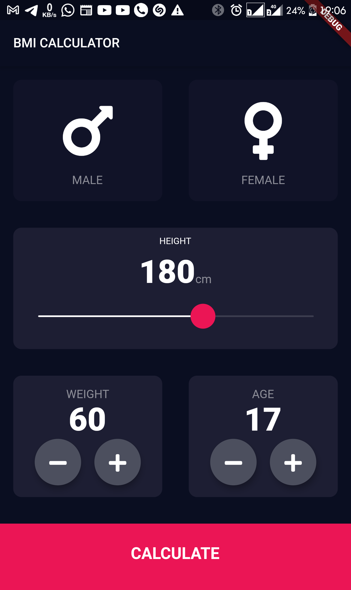
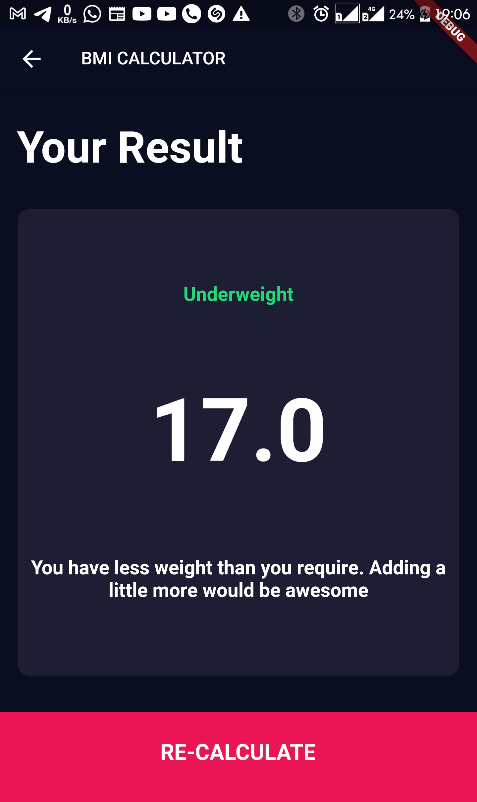
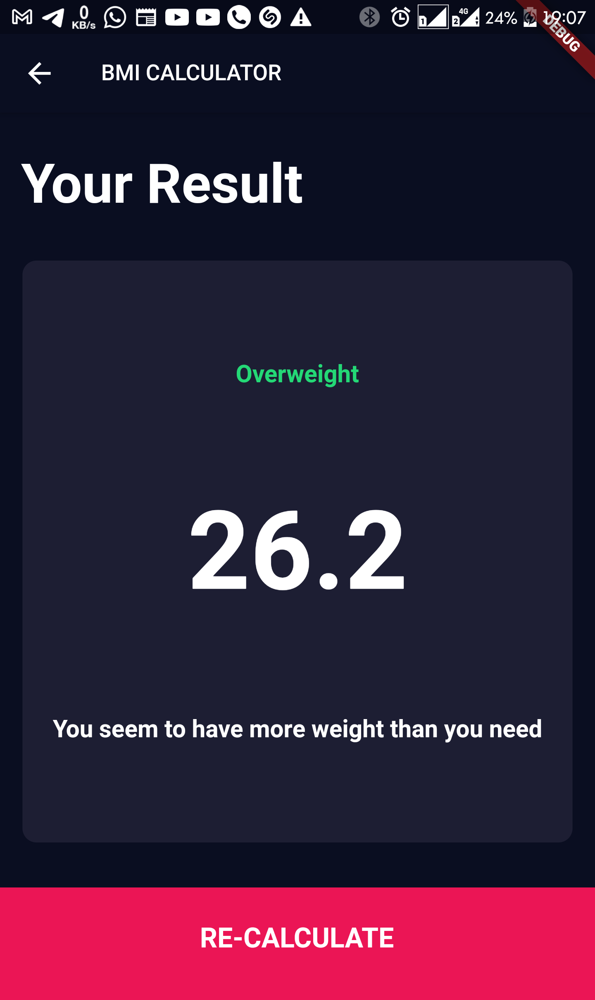

# bmi_calc

A bmi calculator built with flutter. 

## Features

The project teaches the following

* Use of dart enums
* Refactoring flutter widgets
* Creating custom flutter widgets
* Multi-screen navigation
* Building flutter widgets from scratch
* Customising widgets using themes
* Simple calculations using dart

Screenshots of the project are as follows

